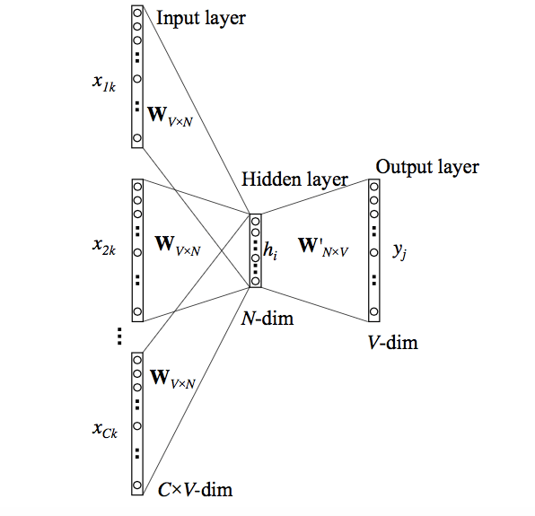

# Continuous Bag-of-Words (CBOW)
CBOW is a word embedding architecture that uses both previous and next words to construct a word embedding.
- Apply a sliding window on the whole data (Corpus).
- Take the middle word in the window as a target, and the others as model input. 

Here, I've used <a href="https://github.com/AlaaSedeeq/Continuous-Bag-of-Words-CBOW/blob/main/Data/t8.shakespeare.txt">Shakespeare data set.</a>

</img>
